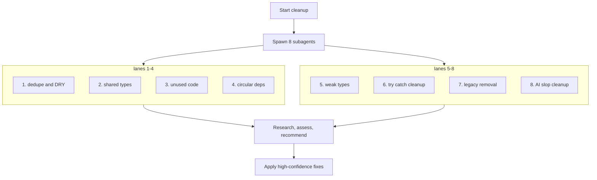

<h1 align="center">🧹 slop-cleanup</h1>

<p align="center">clean up your slop code with this simple skill, 8 subants cleaning it up</p>

<p align="center">Credit: <a href="https://x.com/shawmakesmagic">shawmakesmagic</a></p>

## Install

```bash
npx skills add jasperdevs/slop-cleanup
```


