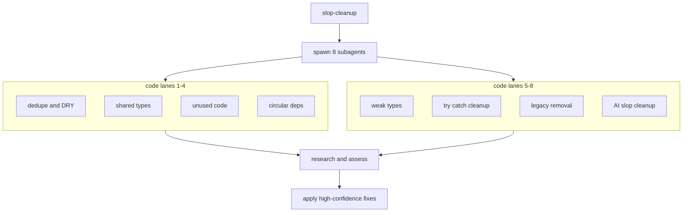
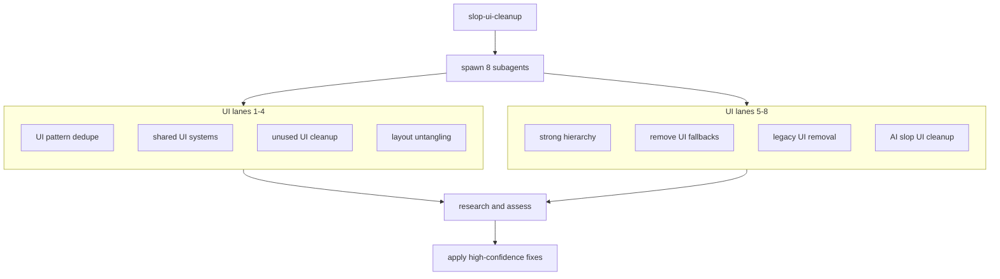

<h1 align="center">🧹 slop-cleanup</h1>

<p align="center">two cleanup skills: one for code, one for UI</p>

<p align="center">Credit: <a href="https://x.com/shawmakesmagic">shawmakesmagic</a></p>

## Install

```bash
npx skills add jasperdevs/slop-cleanup
```

<details>
<summary>Install Manually</summary>

```bash
npx skills add https://github.com/jasperdevs/slop-cleanup --skill slop-cleanup
npx skills add https://github.com/jasperdevs/slop-cleanup --skill slop-ui-cleanup
```

</details>

## `slop-cleanup`

<a href="https://skills.sh/jasperdevs/slop-cleanup/slop-cleanup">View `slop-cleanup` on skills.sh</a>



## `slop-ui-cleanup`

<a href="https://skills.sh/jasperdevs/slop-cleanup/slop-ui-cleanup">View `slop-ui-cleanup` on skills.sh</a>


